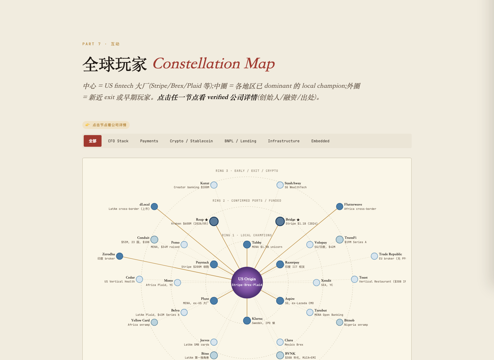
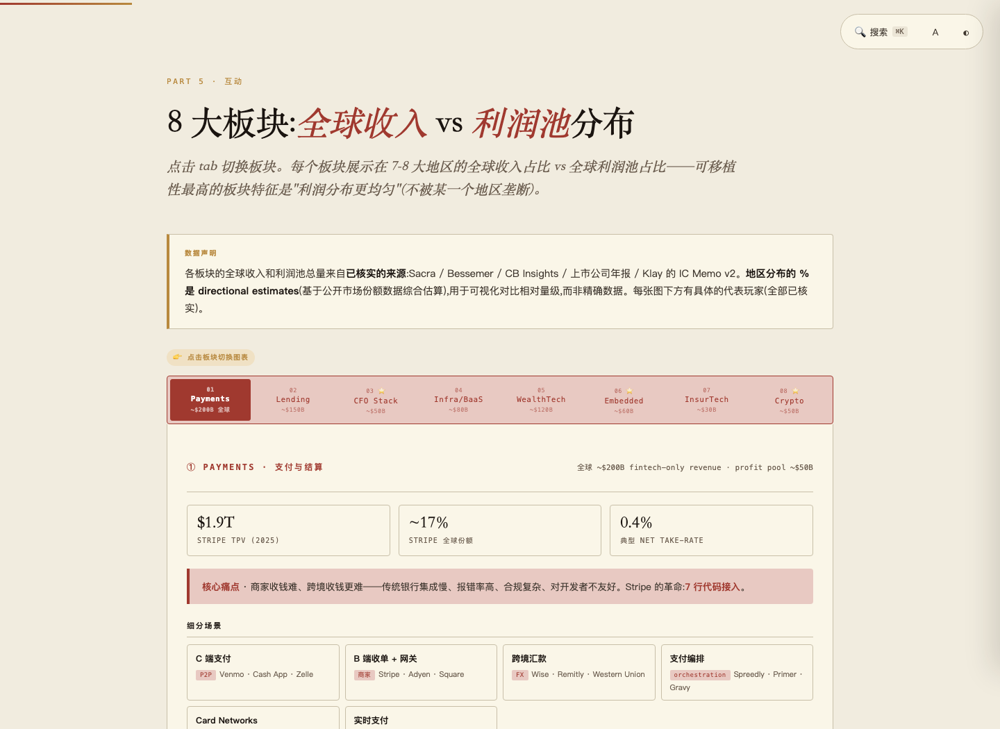
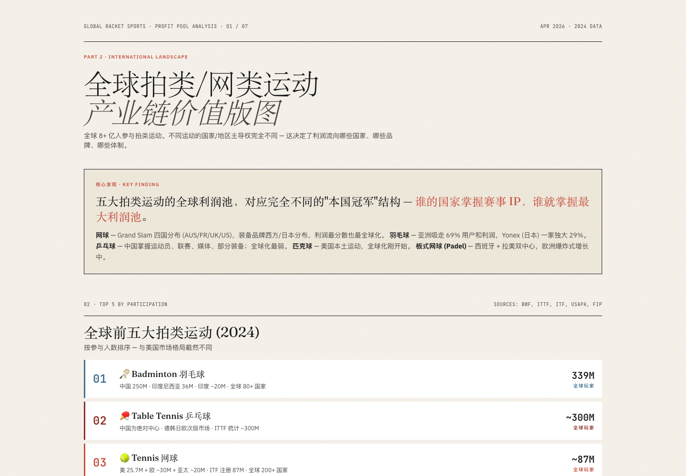

# Interactive Field Guide Skill

> 让 AI agent 产出 VC / CB Insights 级研究报告。6 种操作模式 × 7 种分析视角 × 2 种输出格式。开放 [Agent Skills](https://agentskills.io) 标准。

[](https://agentskills.io)
[](https://github.com/klaywang24/interactive-field-guide-skill/releases)
[](LICENSE)
[](https://github.com/klaywang24/interactive-field-guide-skill/stargazers)
[](https://github.com/klaywang24/interactive-field-guide-skill/releases)
[](https://github.com/klaywang24/interactive-field-guide-skill/commits)
[](README.md)

**快捷入口**：[效果展示](#效果展示) · [Start Here](#start-here--按平台选路径) · [60 秒上手](#60-秒上手) · [Modes](#怎么用各个-mode) · [Personas](#personas-视角) · [Roadmap](#roadmap)

---

## 效果展示

skill 跑出来的 3 份真实报告——不同主题、不同视觉组件、统一 VC 级深度。


*行业战略家视角看 fintech——可交互 SVG 生态图。点任意节点跳转到对应章节。*


*多子赛道行业分析的 tab 结构——不离开页面就能切换不同子赛道。*


*行业级利润池分析（全球网球运动）——价值链经济学，参与方利润分布显式标出。*

---

## v3 新增什么

这**不只是个 HTML 生成器**。v3 把 skill 改造成一个**研究套件**——6 种操作模式按需调用，7 种分析视角彻底改变看问题的角度，2 种输出格式可选。

它的设计是让你**对一个主题反复使用**，不是用一次就完。

| Mode | 什么时候用 |
|---|---|
| **Generate** | 新主题首轮研究 |
| **Discovery** | 重要决策——5 个问题对话产出更深的报告，最后让你选 brief 还是 HTML |
| **Critique** | "我自己写了个分析，帮我找漏洞" |
| **Refresh** ⭐ | "用最新数据更新我 Q1 那份 NVIDIA 报告"——季度复盘的 LTV 引擎 |
| **Compare** | "NVIDIA 和 AMD 用 side-by-side 表格对比" |
| **Drill-down** | "把客户集中度那个分歧扩成独立深度报告" |

**Personas — 核心视角（高频使用）：**

| Persona | 它的视角 |
|---|---|
| **Tier 2 投资人**（公司股票默认）| "做多、做空、还是中性？什么价位？" |
| **行业战略家**（行业默认）| "5 年后利润池往哪迁移？" |
| **工程师** | "技术押注靠不靠谱？给我 benchmark" |
| **竞争对手** | "如果我是对手，从哪里下手攻击？" |

**Personas — 进阶视角（特定场景）：**

| Persona | 它的视角 |
|---|---|
| **Tier 1 投资人** | "这是不是 fund-returner？为什么是现在？" |
| **CEO** | "如果明天我接手，第一件事做什么？" |
| **颠覆侦察兵** | "什么会在 5 年内杀死这个生意？" |

同一个主题，换个 persona = 完全不同的报告。

---

## Start Here — 按平台选路径

| 你用什么 | 怎么装 | 适合谁 |
|---|---|---|
| **Claude.ai** | [下载 v3.0-beta zip](https://github.com/klaywang24/interactive-field-guide-skill/releases) → Settings 上传 | 非开发者 |
| **Claude Code** | `git clone` 进 `~/.claude/skills/` | Anthropic 栈深度用户 |
| **Codex CLI**（OpenAI）| `git clone` 进 `~/.codex/skills/` | OpenAI 生态 |
| **Gemini CLI**（Google）| `gemini skills install <repo-url>` | Google 生态 |
| **Cursor** | `git clone` 进项目 `.cursor/skills/` | 编辑器内研究 |

详细安装命令在 [Install](#安装) 部分。装好后跳到 [60 秒上手](#60-秒上手)。

---

## 60 秒上手

装好后，对你的 AI agent 说这一句：

> *"分析下英伟达基本面，用 Tier 2 投资人视角"*

你会拿到一份可交互 HTML 报告（约 110KB），带来源的事实、反共识假设、明确的 Bull/Bear 场景。浏览器打开就能用。

然后试这几句感受套件：

> *"评判一下这份报告——找漏洞"*  
> *"钻进客户集中度那个分歧"*  
> *"用最新数据 refresh 这份报告"*  
> *"NVIDIA 和 AMD side-by-side 对比"*

每一句激活一种 mode。**合在一起就让这个 skill 从一锤子工具变成研究生命周期工具。**

---

## 输出格式

默认：**可交互 HTML 报告**（约 110KB）——侧栏导航、⌘K 全文搜索、可点击展开 drawer、SVG 生态图、2×2 战略矩阵、22-part 结构化分析。

可选：**Markdown 研究 brief**（1-2 页 memo）——反共识假设、带来源的事实、steel-manned Bull/Bear、watch list。在你说"brief"或"markdown 总结"、或 Discovery 走完后选"只要 brief"时启用。

两种格式同一质量标准：每条事实带 `[Source: X]` 引用，每个判断可证伪，每份 artifact 都有显式反共识。

---

## 怎么用各个 mode

### Generate — 一次性研究

```
"分析下英伟达基本面"
"研究下半导体行业"
"Map 出 Stripe 的战略生态"
```

Skill 自动识别 mode + persona。可以显式覆盖：

```
"分析下英伟达基本面，用 Tier 1 投资人视角"
"研究下半导体行业，从 CEO 视角"
```

### Discovery — 通过对话产出更深报告

```
"先帮我把 NVIDIA 想清楚再生成报告"
"对 AI agent 赛道做研究对话"
```

Skill 走 5 个问题（共识 → 反证 → 假设 → 事实 → steel-man Bull/Bear），**然后问你**：**"要 markdown brief 还是要完整可交互 HTML 报告？"**

**什么时候用 Discovery**：高 stakes 决策、仓位决定、要给老板看的内部 memo。

### Critique — 对抗式审查

```
"看一下我这份 NVIDIA 分析，找漏洞"
"这份报告评判一下——找未注明出处的论断和弱反共识"
```

提供已有分析。Skill 产出 **Markdown 评论**（不出 HTML）——最强论断、最弱论断、缺什么、具体怎么修。

### Refresh — 用最新数据更新 ⭐

```
"用最新数据更新我 Q1 那份 NVIDIA 报告"
"复盘我 1 月做的 Stripe 分析"
"我那份 AI agent 赛道格局报告——三个月过去了发生了什么变化？"
```

提供之前的报告。Skill 会刷新每个数字、标实质变化、重新评估反共识假设、在顶部加"自 [日期] 以来变化"提示框。

**这是 LTV 模式。** 市场每季度都在变。每个你持有的标的，每季度用一次。

### Compare — 平行对比

```
"NVIDIA 和 AMD 做对比"
"Stripe vs Adyen——哪个更适合做多？"
"Cursor vs GitHub Copilot——技术 head-to-head"
```

产出对比报告，hero 区有 10-15 维度对比表，各章节有 side-by-side 小表，最后给明确评分。

### Drill-down — 扩展子章节

```
"我那份 NVIDIA 报告里钻进客户集中度"
"把 'AI 工厂运营' 那个论点单独做一份"
```

Skill 把母报告里某个子章节当作**新报告的全部主题**——做完整的 22-part 处理。

---

## 为什么做成套件，不是单一工具

大多数研究工具是一锤子买卖。真实研究不是：

1. 从多个角度看同一主题（= **personas**）
2. 时间推移后更新分析（= **Refresh** ⭐）
3. 决策前对比选项（= **Compare**）
4. 压力测试自己的结论（= **Critique**）
5. 钻进关键分歧（= **Drill-down**）
6. 思考过程中给自己 coaching（= **Discovery**）

Garry Tan 的 [gstack](https://github.com/garrytan/gstack) 在工程领域证明了这个道理——一个虚拟团队比一个万能助手强得多。这个 skill 把同样原理用到研究上。

**一个主题，6 种 mode，7 种 persona，反复使用。** 加上 persona 矩阵——一个用户 × 一个主题 × 多 persona × 季度 refresh × drill-down = **长期能产出十几份不同的报告**。

---

## 兼容性

本 skill 遵循开放 [Agent Skills 标准](https://agentskills.io)（Anthropic 于 2025 年 12 月发布）。**任何兼容 agent 都能加载它**——但**输出质量取决于底层模型**。

| Agent | 安装路径 | 状态 |
|---|---|---|
| **Claude.ai** | Settings 上传 zip | ✅ 参考实现 |
| **Claude Code** | `~/.claude/skills/` | ✅ 参考实现 |
| **Codex CLI**（OpenAI）| `~/.codex/skills/` | 🟡 格式兼容，输出未验证 |
| **Gemini CLI**（Google）| `~/.gemini/skills/` | 🟡 格式兼容，输出未验证 |
| **Cursor** | `.cursor/skills/`（仅项目级）| 🟡 格式兼容，输出未验证 |

> **🟡** = 格式能加载，但 HTML 渲染质量没在这些平台亲自验证过。本 skill 设计前提是**强推理 + 长 context + 联网搜索**——质量最好的是 Claude Opus / GPT-5 / Gemini 2.5 Pro。

---

## 边界——这个 skill 不是什么

本 skill 产出**研究框架**，包含可证伪信号、带来源的事实、结构化的 Bull / Bear 分析。它**不是个性化投资建议**，**不能替代持牌财务顾问**。

输出被定位为分析 artifact，不是买卖建议。每份输出底部都带这个免责声明。

---

## 安装

### 1. Claude.ai（推荐非开发者用）

1. 下载最新 zip：[releases 页面](https://github.com/klaywang24/interactive-field-guide-skill/releases)
2. Claude.ai → **Settings** → **Capabilities** → 打开 **Code execution and file creation**
3. **Customize** → **Skills** → **+** → **Upload a skill** → 选 zip → 打开开关
4. 试一句：*"分析下英伟达基本面"*

### 2. Claude Code

```bash
git clone https://github.com/klaywang24/interactive-field-guide-skill.git \
  ~/.claude/skills/interactive-field-guide
```

重启 Claude Code，skill 自动识别。

### 3. Codex CLI（OpenAI）

```bash
codex --enable skills

git clone https://github.com/klaywang24/interactive-field-guide-skill.git \
  ~/.codex/skills/interactive-field-guide
```

重启后 `/skills` 验证。

### 4. Gemini CLI（Google）— 见下方[配置说明 ↓](#gemini-cli-配置)

```bash
gemini skills install https://github.com/klaywang24/interactive-field-guide-skill
```

### 5. Cursor — 见下方[配置说明 ↓](#cursor-配置)

```bash
mkdir -p .cursor/skills
git clone https://github.com/klaywang24/interactive-field-guide-skill.git \
  .cursor/skills/interactive-field-guide
```

重新加载窗口：**Cmd/Ctrl+Shift+P** → **Developer: Reload Window**

---

## 配置说明

本 skill 需要 agent 提供四种能力：**(1) 联网搜索**、**(2) 文件写入**、**(3) Python 或 Node**、**(4) 长 context**（约 50K token）。

Claude.ai / Claude Code 默认全有。Codex / Gemini / Cursor 有时候没全开。

### Gemini CLI 配置

**A. 联网搜索必须开。** 会话内 `/tools list`——找 `google_search`。

**B. 文件写入权限。** 跳过每次弹窗：

```jsonc
// ~/.gemini/settings.json
{ "tools": { "auto_approve": ["write_file"] } }
```

**C. 工作区信任**（仅 `.gemini/skills/` 时）。运行 `/trust`，或装在 `~/.gemini/skills/` 用户路径下。

### Cursor 配置

**A. 用 Agent 模式**——不是 Ask。Chat 面板顶部 → 选 **Agent**。Skill 只在 Agent 模式触发。

**B. 联网搜索必须开。** Settings → **Features** → **Agent** → 打开 **Web search**。

**C. 允许终端命令。** Settings → **Features** → **Agent** → 开 **Allow terminal commands**。

**D. 选强模型。** Settings → **Models** → Claude Sonnet 4.6 / Opus 4.7 / GPT-5 / Gemini 2.5 Pro。

**E. 输出位置。** Skill 自动检测平台，HTML 写到项目根目录。

---

## 不同模型的输出质量

| 模型 | 预期质量 | 备注 |
|---|---|---|
| Claude Opus 4.7 | ⭐⭐⭐⭐⭐ | 参考实现 |
| GPT-5 / GPT-5-Codex | ⭐⭐⭐⭐ | 推理强 |
| Gemini 2.5 Pro | ⭐⭐⭐⭐ | 长 context 优秀 |
| Claude Sonnet 4.6 | ⭐⭐⭐⭐ | 更快更便宜 |
| Gemini 2.5 Flash / GPT-4o-mini | ⭐⭐⭐ | 适合做初稿 |

输出感觉浅 → **先换更强的模型再说**。

---

## 文件结构

```
interactive-field-guide-skill/
├── SKILL.md                       # 轻量级路由器
├── assets/
│   ├── template.html              # 1500 行 HTML 模板
│   └── screenshots/               # README 视觉展示
└── references/
    ├── modes.md                   # 6 种操作模式工作流
    ├── personas.md                # 7 种分析视角 lens
    ├── structure.md               # 22-part 菜单 + skip 规则
    ├── data-schemas.md            # JS 对象 schema + 组件
    ├── content-strategy.md        # 来源分级、可证伪规则
    └── pitfalls.md                # 校验检查
```

SKILL.md 是路由器，识别 mode + persona + 格式后派发。Personas 描述"看问题的角度"（topical emphasis），不是具体章节编号——agent 在执行时映射到当前 structure.md 的 22-part 结构。

---

## 样例库

| 样例 | Mode | Persona | 展示了什么 |
|---|---|---|---|
| Fintech 行业生态星座图 | Generate | 行业战略家 | 可点击节点的 SVG 生态图 |
| Fintech 子赛道导航 | Generate | 行业战略家 | 多子赛道 tab 结构 |
| 全球网球运动 | Generate | 行业战略家 | 行业价值链利润池映射 |
| NVIDIA 基本面 | Generate | Tier 2 投资人 | 反共识假设 + 可证伪 Bull/Bear |

更多样例会在 Q2 2026 在配套 [`awesome-field-guides`](https://github.com/klaywang24) repo 发布。

---

## Roadmap

**2026 Q2**（开发中）：
- Compare 模式真正的 2 列镜像布局
- `scripts/validate-field-guide.js` 和 `scripts/validate-compare.js` 独立脚本
- pitfalls.md 加 mode-specific 校验

**2026 Q3**（计划中）：
- "Watch list" mode——被动追踪 5-10 个标的，发生实质变化时自动告警
- `agents/openai.yaml` 给 Codex 生态更好展示
- 提交到 skills.sh 市场
- 注册到 Claude Code Plugin Marketplace
- 配套 [`awesome-field-guides`](https://github.com/klaywang24) repo 收录样例

**2026 Q4**（探索中）：
- 语音模式 Discovery
- 协作式 Critique（多 agent 辩论同一份分析）
- 双语自动输出切换

---

## 故障排除

**Skill 没触发。** 触发是有意收紧的——只在用户要"公司 / 行业 / 市场 / 竞争 / 战略 / 投资研究 artifact"时触发。强制触发：*"给 X 生成一份 field guide"*。

**Mode 识别错了。** 显式说："用 Discovery 模式分析 X" 或 "对这份做 Critique"。

**Persona 感觉不对。** 显式指定："...用 Tier 1 投资人视角" 或 "...用工程师 lens"。

**输出太浅。** 大概率是模型问题。换 Claude Opus 4.7 / GPT-5 / Gemini 2.5 Pro 重跑。

**Refresh 找不到旧数据。** 确认你上传或粘贴了之前的 field guide。Skill 没有跨会话记忆。

**Compare 看起来还是单列。** v3.0-beta 用对比表实现，不是镜像 2 列布局。完整镜像在 Q2 roadmap。

---

## 为什么叫 "field guide" 不叫 "report"

Report 是看一遍就放下的。Field guide 是你会一直开着、搜索、点来点去、反复回去看的。这个输出的设计是为后一种行为。

但更重要：field guide 是给"导航"用的，不是给"展示"用的。22-part 结构、可证伪判断、带来源的事实——这些不是格式，是让产物**值得信任**的研究纪律。

Skill 把这套纪律编码进来。HTML 是产物。**纪律才是产品。**

---

## 协议

Apache 2.0。随便用、fork、改。欢迎 PR——特别是平台兼容性问题、新 persona 贡献、mode-specific 校验脚本。

## 作者

[@klaywang24](https://github.com/klaywang24) 制作。[Nexar](https://nexar.io) 创始人——为美国 DTC 品牌做创作者支付决策层。

如果这个 skill 对你有用，给个 ⭐。如果**很**有用，发一张你跑出来的 field guide 截图——这是最高级的赞美。
